Source: <https://freewechat.com/a/MzAxMjMyMDk0Ng==/2650112053/1/1580318101>,
archived at <https://archive.ph/Zretg>

Text translated using [deepL](https://www.deepl.com);  
images translated with Google Lens.

---

*This content has been removed by the publisher This content was recovered by Free WeChat.  
The article was detected as deleted on Jan 31, 9:31 PM.*

# Documenting the first experience of discovering a novel coronavirus

*2020-01-30 Original Winjor 小山狗 Little Mountain Dog*

On December 26, 2019, I just started work. As usual, I will go through the mNGS pathogenic microbial automated readings for the day, and if there are no problems, I will start my R&D work for the day.

Unexpectedly, I found that one sample reported a sensitive pathogen, SARS coronavirus, with dozens of sequences, and there was only one meaningful pathogen in this sample, which would have been a fairly reliable result if it was an ordinary virus. The heart is tight, rushed to the background to view the detailed analysis data, found that the similarity is not very high, only about 94.5% (this is related to the threshold of card similarity, equivalent to only filter down the sequence with a high degree of similarity). Several possibilities came to mind: 1. there are certain differences in the genomes of different strains of SARS; 2. RNA viruses are prone to mutation, and 17 years after the SRAS event, the variation is relatively large; 3. incorrect comparison of closely related species, etc. In order to confirm the reliability of the results, a detailed analysis was started.

The good thing is that I have already encountered this kind of sensitive pathogen confirmation analysis work several times before, and the leader has also discussed with me several times whether we can do a new pathogen automatic mining analysis process, and I have always kept this in mind, and I have made a preliminary version of it when doing other projects with higher weight and priority, and this sample can just be used. I gave it a name, and it has an additional suffix: "Exploratory Version", which includes almost all sequenced viral genomes, compared to the daily production analysis process.

The results of the Exploratory Edition analysis suggest that this pathogen is most similar to Bat SARS like coronavirus, with an overall similarity of about 87%, while the similarity to SARS is about 81%. The number of sequences on the comparison rose from a few dozen to more than 500, and in addition 5 contigs were also assembled, adding up to more than 1200 bp, at which point it was basically confirmed to be a coronavirus and could be analyzed in detail for coronaviruses. During the analysis, we also started a small internal confidential discussion with the head and leader of the interpretation.

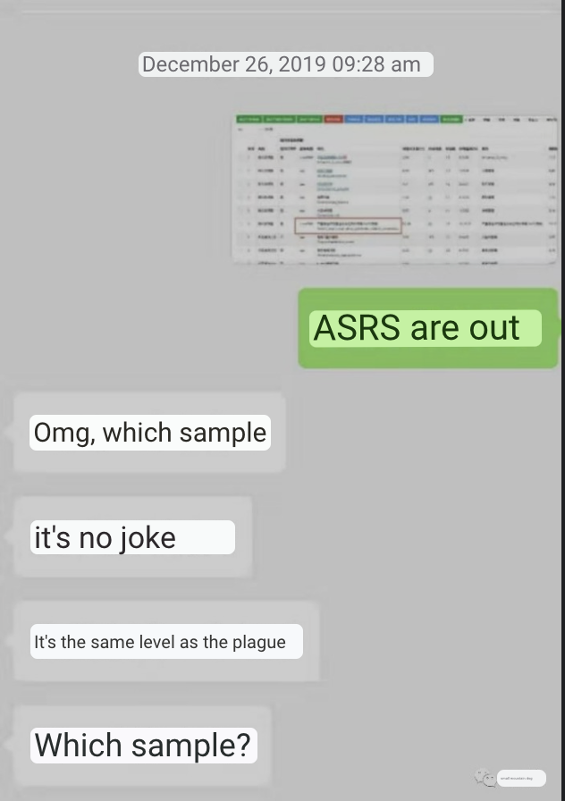  
*December 26, 2019 09:28 am  
SARS are out  
Omg, which sample  
it's no joke  
It's the same level as the plague  
Which sample?*

Further analysis, whether we take the original sequence to NCBI nt library blastn or take the assembled sequence to blastn, the result is most similar to Bat SARS like coronavirus, but the overall similarity is also only about 87%, and the similarity for nr library protein blastx comparison is also similar, so we reserve doubt on the result.

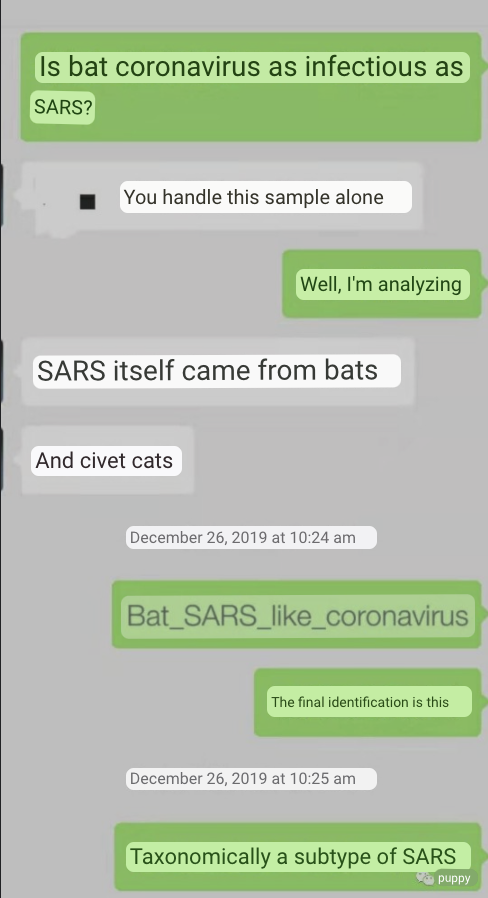  
*Is bat coronavirus as infectious as SARS?  
You handle this sample alone  
Well, I'm analyzing  
SARS itself came from bats  
And civet cats  
December 26, 2019 at 10:24 am  
Bat_SARS_like_coronavirus  
The final identification is this  
December 26, 2019 at 10:25 am  
Taxonomically a subtype of SARS*

The classification information of viruses has been confusing, and the classification rules are not uniform, some are based on typing genes (such as influenza A), others do not have clear typing genes, and are classified by other methods. We have not researched the classification of Bat SARS like and SARS before, but in NCBI Taxonomy, Bat SARS like is classified under SARS. Based on the genomic similarity, I subconsciously thought that since Bat SARS like was a subordinate classification of SARS, the unknown virus detected was at least a parallel species to Bat SARS like, i.e., a novel Bat SARS like (later, I read the literature). SARS and Bat SARS like are classified by several non-structural proteins).

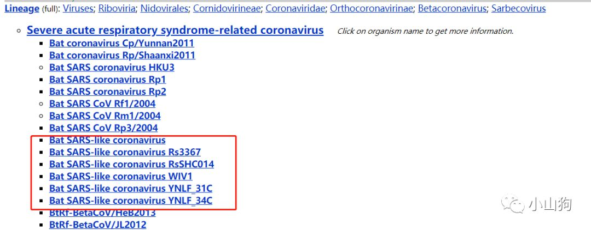

Several thousand coronavirus genomes were further carpet-analyzed and evaluated in terms of similarity, coverage, and uniform genome distribution, and finally the two most similar strains were identified, bat-SL-CoVZC45 and bat-SL-CoVZXC21 (the same two that were analyzed in many articles after the genome sequence was published on January 9).

(Figure posted to the group only this afternoon)

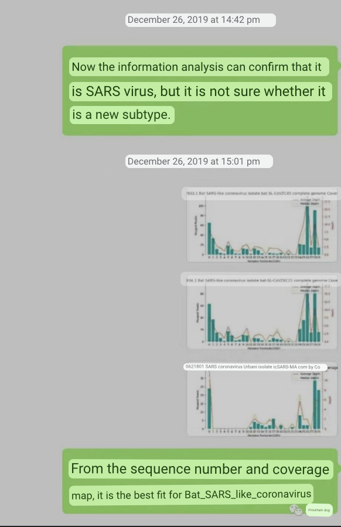  
*December 26, 2019 at 14:42 pm  
Now the information analysis can confirm that it  
is SARS virus, but it is not sure whether it  
is a new subtype.  
December 26, 2019 at 15:01 pm  
933.1 at SARS coronavirus isolate bat SL COVZC45 complete genome Caver  
9341 Bat SAR-ke coronavirus isolate bat-SL-COVZXC21 complete genome Cove  
0621801 SARS coronavirus Urbani isolate icSARS-MA com by Co  
From the sequence number and coverage map, it is the best fit for Bat_SARS_like_coronavirus*

This information alone is not enough, at least to look at the evolutionary information, so began to do evolutionary tree analysis.

  
*December 26, 2019 at 10:25 am  
Taxonomically a subtype of SARS  
Can you make a phylogeny tree, plus coronavirus, SARS, MERS from humans, bats, civet cats and several other mammals  
I'm looking for genomes to do this  
OK  
Too many categories to find*

The genomes of all coronaviruses were downloaded, and finally 160 strains of coronavirus genes (basically containing all known coronaviruses of various animals) were filtered out after quality filtering and clustering analysis. The assembled sequences were analyzed with the 160 coronavirus genomes based on the average genome-wide similarity. (As an aside, I believe that in species evolution analysis, it is more accurate and reasonable to build an evolutionary tree based on the average gene-wide similarity than on a gene. (Of course, studying the structure, function, etc. is another story, and at this time the assembled sequences are also very short, and there is no complete gene sequence), the result is, not surprisingly, the closest to Bat SARS like coronavirus, and is also on the big branch of SARS.

(It ran late into the evening before the figure was released)

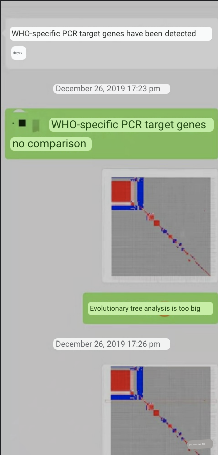  
*WHO-specific PCR target genes have been detected
do you  
December 26, 2019 17:23 pm  
WHO-specific PCR target genes  
no comparison  
Evolutionary tree analysis is too big  
December 26, 2019 17:26 pm*

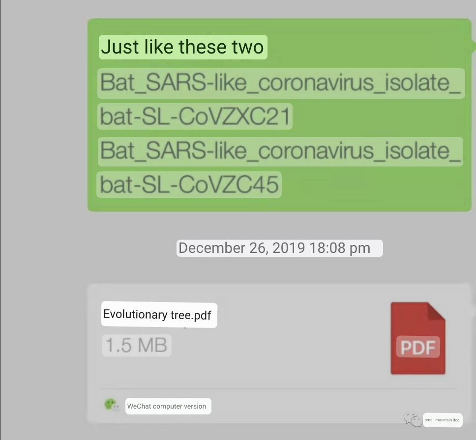  
*Just like these two  
Bat_SARS-like_coronavirus_isolate_bat-SL-CoVZXC21  
Bat_SARS-like_coronavirus_isolate_bat-SL-CoVZC45  
December 26, 2019 18:08 pm  
Evolutionary tree.pdf  
1.5 MB PDF  
WeChat computer version*

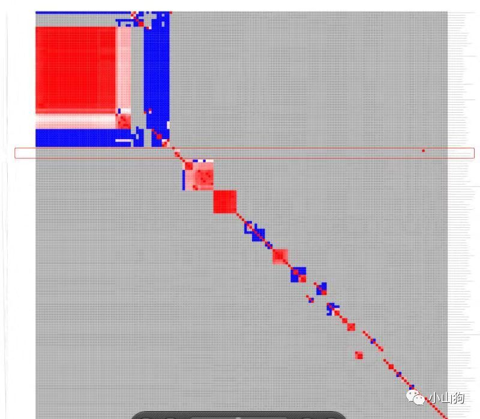  
Note: A large piece of red in the upper left corner is SARS, the edge color is not so red is Bat SARS like, and then the large blue edge outside is another group of Bat SARS like, unknown virus and 45, 21 gathered in a relatively independent one, circled by the red box.

It is strange that this unknown virus clustered with bat-SL-CoVZC45 and bat-SL-CoVZXC21 in a relatively independent branch, while other Bat SARS like clustered in the group of SRAS, thinking that maybe the classification of these two is a bit problematic, but after reading the literature, the method is not different from the others. We respect the classification of the literature and consider it to be correct for the time being. (This is also one of the bases for some experts to determine this unknown virus as a novel coronavirus)

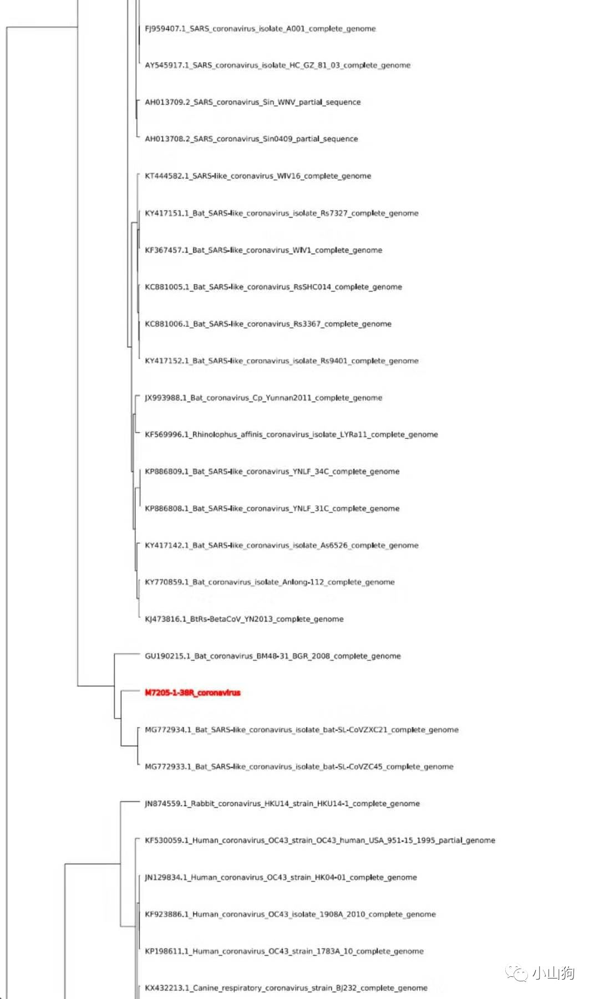  
(Partial evolutionary tree screenshot)

The front-end feedback that this patient is seriously ill and anxious for the test results, but such a major pathogen really cannot be reported easily, so I had an urgent meeting with several leaders at noon and decided to continue the in-depth analysis and delay the release of the report, while sharing the data to the Institute of Pathogenesis of the Chinese Academy of Medical Sciences for a piece of analysis.

The later in-depth analysis was conducted from the gene level (orf1ab, S, N and other genes), and there were no more meaningful findings, mainly because the number of sequences detected was low, the coverage was too low, and all were incomplete genes to do anything.

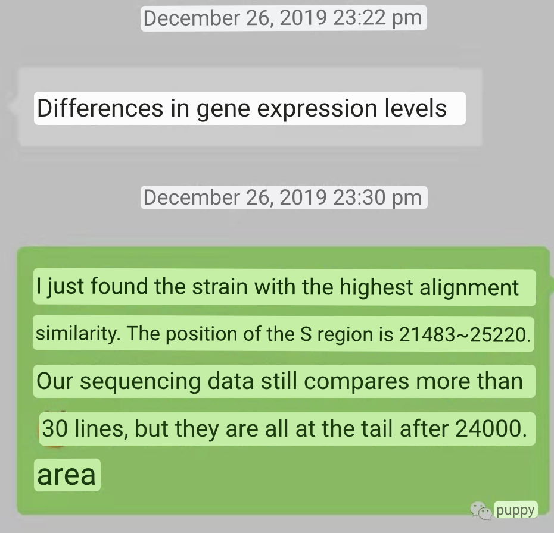  
*December 26, 2019 23:22 pm  
Differences in gene expression levels  
December 26, 2019 23:30 pm  
I just found the strain with the highest alignment similarity. The position of the S region is 21483~25220. Our sequencing data still compares more than 30 lines, but they are all at the tail after 24000. area*

Retesting of complementary data for analysis has been proposed at noon. Retesting allows for technical reproducibility validation, avoiding false positives due to contamination by some unknown factors, ensuring that the sample does have the pathogen, and additionally allows for more data to be analyzed, such as the ability to assemble a complete genome, with more reliable analysis results and more in-depth analysis that can be done.

  
*December 26, 2019 at 12:09 noon  
method can do enrichment?  
See if you can assemble a more complete genome  
Looks like a new*

After the data came out early the next morning (2019.12.27), an assembly analysis was hurriedly performed and finally a near complete genome sequence was assembled. The data was also shared with the Institute of Pathogenesis, Chinese Academy of Medical Sciences for other in-depth analysis. This time the number of sequences rose from the previous 500 or so to more than 470,000!

  
*December 27, 2019 at 09:48 am  
After retesting, the assembly is longer.  
One 16k, one 10k*

[!screenshot13](pics/littledog_13_translated.png)  
*December 27, 2019 at 10:12 am  
NODE_1_length_16579_cov_266.242859  
NODE_2_length_10596_cov_239.765392  
NODE_3_length_2211_cov_712.139610  
NODE_6_length_557_cov_371.448207  
Assemble 4 sequences, which add up to exactly 29.9k, which is in line with the length of SARS*

Because of the limited time and other R&D projects, we did not go into details of the assembly results to obtain the complete genome. In addition, we have shared the data with the Pathogen Institute, and they will also do this, so we have not assembled a complete genome sequence, and the existing assembly results can meet most of the analysis needs.

The results of the existing assembly can meet most of the analysis needs. The later also continued to do some in-depth analysis.

The repo sequences were evenly distributed with no obvious preference, the average depth and median depth were basically the same, and the depth reached 1000x, indicating that there was no problem with the assembly and the sequencing was quite good, and the unknown pathogen was also a complete genome present.

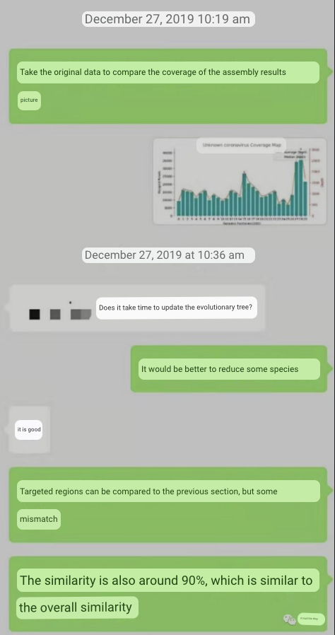  
*December 27, 2019 10:19 am  
Take the original data to compare the coverage of the assembly results picture  
Unknown coronavirus Coverage Map  
December 27, 2019 at 10:36 am  
Does it take time to update the evolutionary tree?  
It would be better to reduce some species  
it is good  
Targeted regions can be compared to the previous section, but some mismatch  
The similarity is also around 90%, which is similar to the overall similarity*

The evolutionary tree was reconstructed, this time selecting all NCBI reference strains of coronaviruses (with registration numbers starting with NC, officially considered the most credible), plus a few strains from the most recent source analyzed the day before.

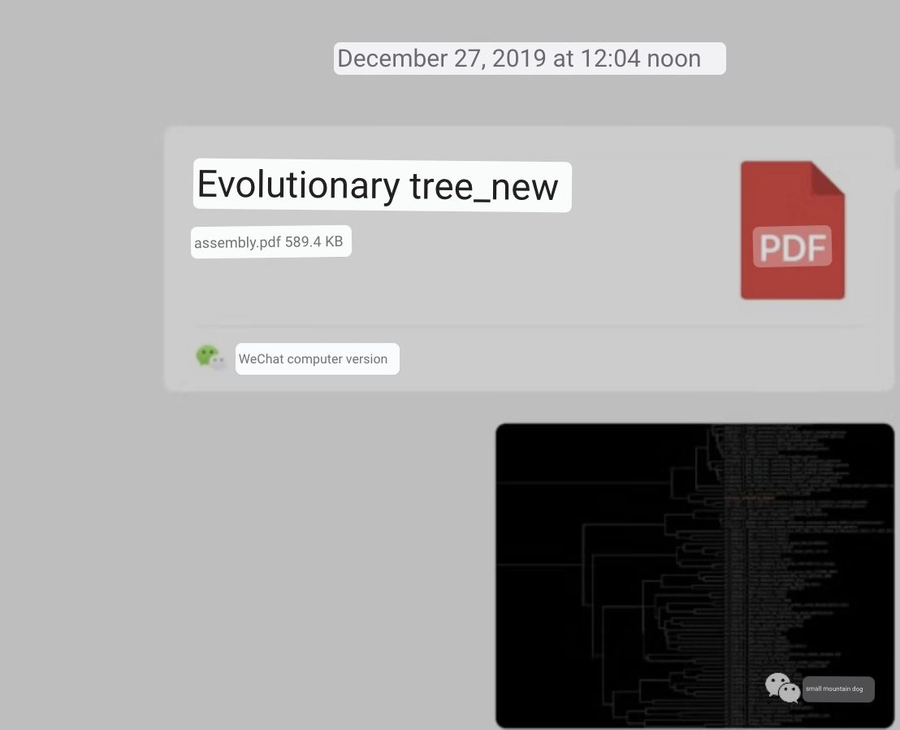  
*December 27, 2019 at 12:04 noon  
Evolutionary tree_new  
assembly.pdf 589.4 KB*

The evolutionary tree results are basically the same as the previous day's.

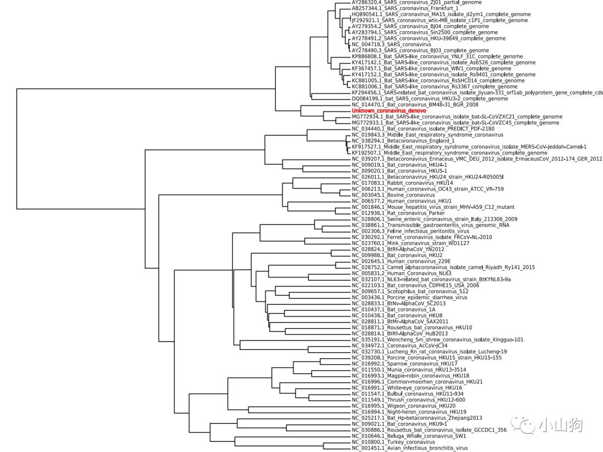

Genomic covariance analysis, ORF annotation, etc. indicate that this unknown coronavirus is a typical BetaCoV (orf1ab, S, M, N, E, etc. genes). The lighter color in the covariance map is the S protein region, which is the most differential gene.

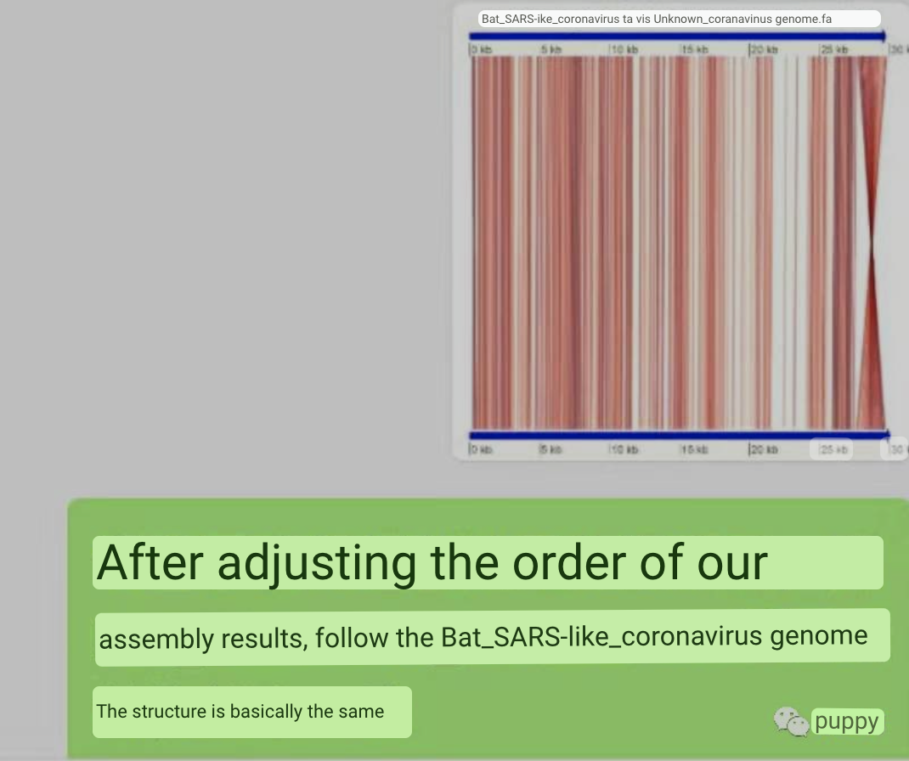  
*Bat_SARS-ike_coronavirus ta vis Unknown_coranavinus genome.fa  
(25 kb 130
After adjusting the order of our assembly results, follow the Bat_SARS-like_coronavirus genome  
The structure is basically the same*

After comparing with the 7 PCR validated target sequences for SARS recommended by the WHO official website, it was found that the average similarity was also only about 90%, and the key was that the primer sequences also had several variants, presumably the SARS detection kit could not detect this unknown pathogen (the same was true for the experimental validation in many places later).

In addition, many other detailed in-depth analyses were done for genes and proteins, so I will not repeat them.

At this point in the analysis, it was basically confirmed that there was indeed a virus in this patient's sample, but this virus was not very similar to all viruses with known genomic information, and might be a new virus similar to Bat SARS like coronavirus.

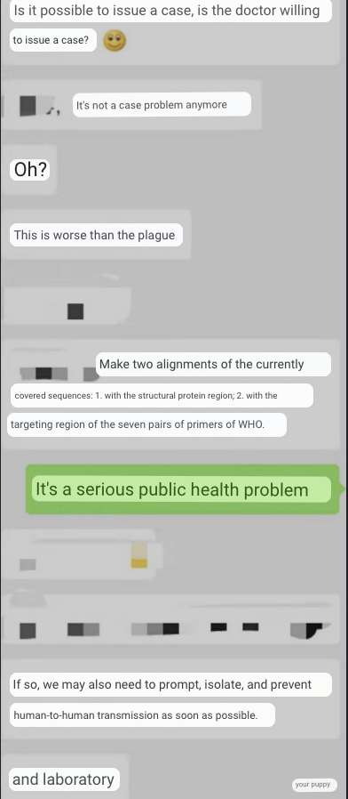  
*Is it possible to issue a case, is the doctor willing to issue a case?  
It's not a case problem anymore  
Oh?  
This is worse than the plague  
Make two alignments of the currently covered sequences: 1. with the structural protein region; 2. with the targeting region of the seven pairs of primers of WHO.  
It's a serious public health problem  
If so, we may also need to prompt, isolate, and prevent human-to-human transmission as soon as possible.  
and laboratory*

(Now look back at my words at that time, it is really a prophecy, sorry to the whole country, it is my fault this crow's mouth)

This is not necessarily SARS, contagious, pathogenicity are unknown, while also aware of the potential seriousness of the problem, the laboratory did a comprehensive cleanup and disinfection, the samples harmlessly destroyed, the experimental operations related to the monitoring of personnel.

Next is the question of how to report, direct reporting may scare doctors, not to mention that this may be a new virus, the wrong report is a major accident. There is some necessary information that still needs to be ranked first.

The first thing that comes to mind is, of course, the history of wildlife exposure. The information we got at the time was that this patient had been back home, and we could not rule out the possibility that he had been exposed to bats, or had been bitten by bats.

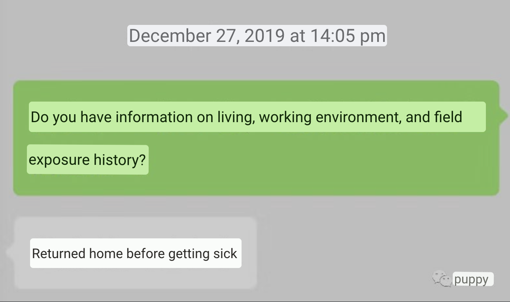  
*December 27, 2019 at 14:05 pm  
Do you have information on living, working environment, and field exposure history?  
Returned home before getting sick*

Also had doubts about where the artificial virus related to the operation of the staff accidentally infected, after all, some time ago the brucella mass infection is because of a factory sterilization is not complete triggered.

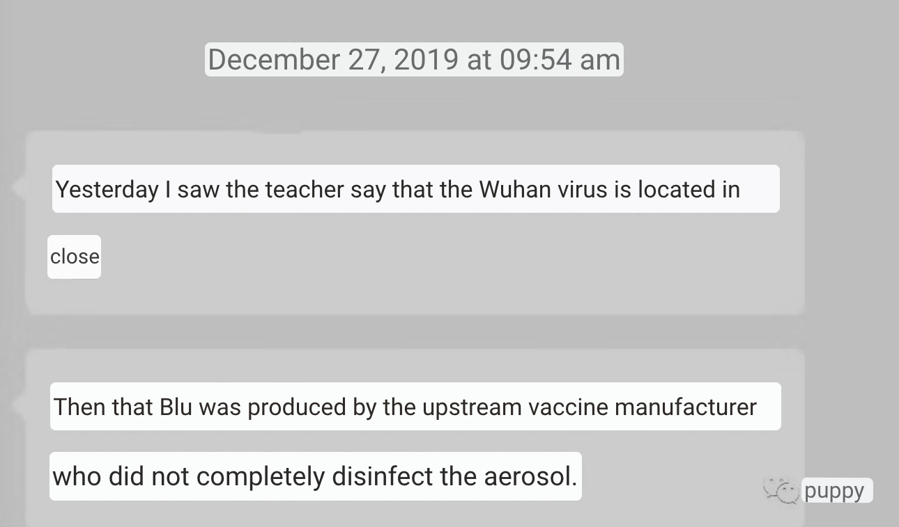  
*December 27, 2019 at 09:54 am  
Yesterday I saw the teacher say that the Wuhan virus is located in close  
Then that Blu was produced by the upstream vaccine manufacturer who did not completely disinfect the aerosol.*

There is no more information, or we must hurry to communicate with the doctor about this matter, after all, we can guarantee that the samples sent for testing is the unknown virus inside, other things will be left to the doctor to investigate and deal with.

The doctor has been communicated with before noon, and the patient has been isolated.

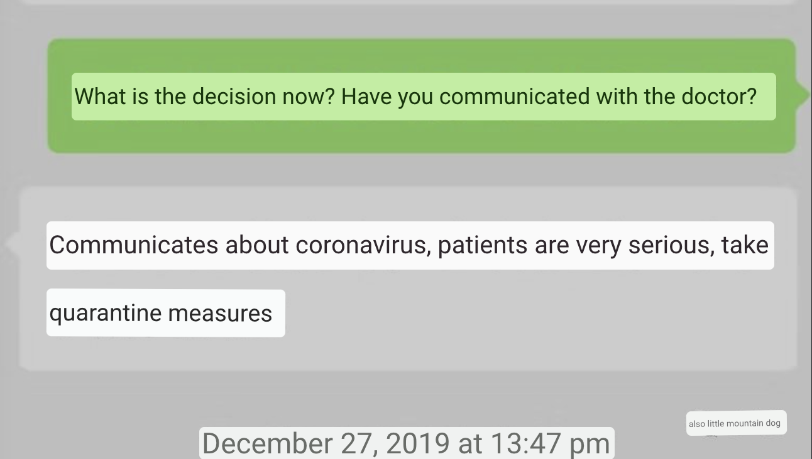  
*What is the decision now? Have you communicated with the doctor?  
Communicates about coronavirus, patients are very serious, take quarantine measures  
December 27, 2019 at 13:47 pm*

Because no other information is available, the patient is also isolated, and the virus is not a real SARS, thinking that maybe it is just a wild Bat SARS like, the contagiousness is unknown, so the nervousness is also somewhat relaxed. But because the patient is seriously ill, it should not be underestimated, and we are still in close communication with the hospital. During the period also continue to do some in-depth analysis, 27th, 28th company leaders are also with the hospital and the CDC people on the phone to communicate this matter, 29th, 30th also personally went to Wuhan with the hospital, the CDC leadership face to face to report the exchange of this matter, including all our analysis results and the Academy of Medical Sciences Institute of Pathogenesis analysis results. Everything was under intense, confidential and strict investigation (at this time, the hospital and the CDC people already knew that there were several similar patients, and we communicated the test results after the emergency treatment had already begun, but I did not know it).

I thought this would pass quickly, after all, in addition to this patient, it seems that no other patients heard the news of infection, but by December 30, heard the news that there are quite a number of patients with similar symptoms, nerves again suddenly tense. In particular, about the afternoon of the 30th, a "friend" may have detected the same virus in another patient's sample, but they directly sent a report on the detection of SARS coronavirus, which instantly set the news off. In the evening, the relevant authorities also issued an announcement of "pneumonia of unknown origin", and the rumors started spreading on Weibo in the early hours of the 31st.

What really made me nervous again was that our friends shared the sequence for us to analyze, and when I did, it was indeed the same virus! The first subconscious thought was "this virus is contagious"! Maybe it is a new type of SARS!

Late on the 30th, we got the sequences from Friends for analysis.

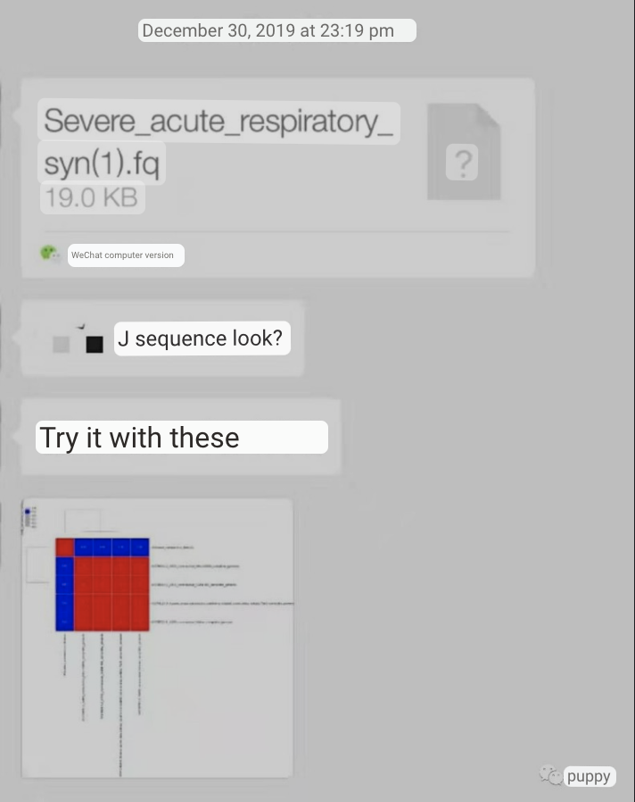  
*December 30, 2019 at 23:19 pm  
Severe_acute_respiratory_syn(1).fq  19.0 KB  
J sequence look?  
Try it with these*

  
*Is there one after filtering the host? This should be compared to the Master's SARS, which is equivalent to the one after screening.  
I only have this now. how many sequences are there  
December 30, 2019 23:34 pm  
Simultaneously two or two clusterW?  
Only 50+ sequences  
December 30, 2019 at 23:42 pm  
got together.*

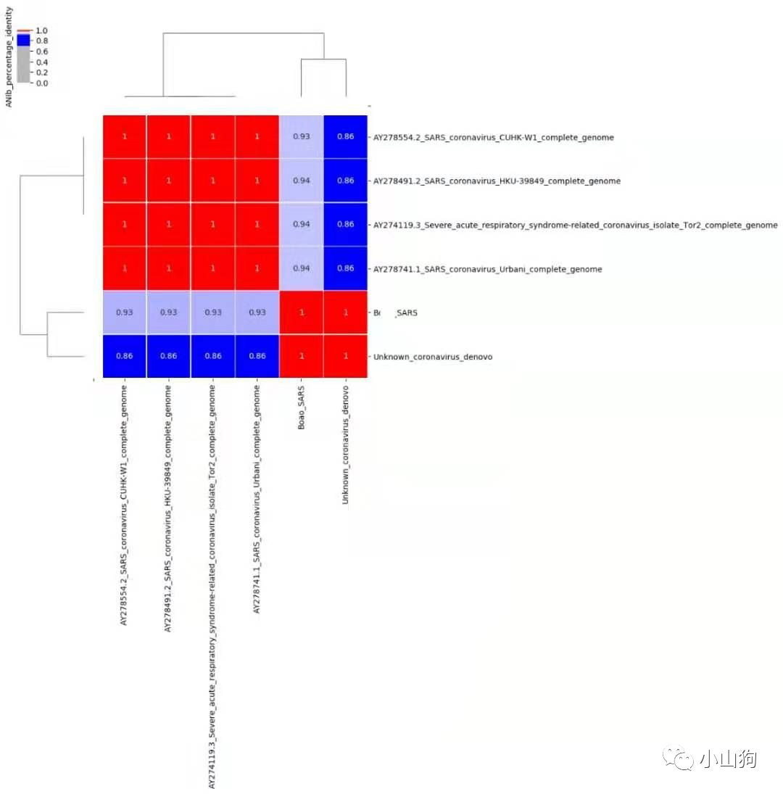

(Since the friendly sequence was screened against SARS, it is 93% similar to SARS, while our complete sequence is about 86%, but the homology between the two is still close to 100%)

  
*December 30, 2019 at 23:50 pm  
Take ours directly as a reference and compare their fq directly, the mismatch rate is very low  
hmm, send me some data  
December 31, 2019 00:02 am  
| Map_read
N
19 59  
So aside from the sequence being filtered, basically a something  
yes*

Two by two direct comparison, all sequences can be matched, the degree of similarity reached 99.6%, and then conservative region, the similarity between different species is almost impossible to be so high, and the whole genome coverage is more than 20%, confirming that it is undoubtedly the same virus!

The emotions at this point were both nervous and excited. I was nervous because this unknown virus might be as horrible as SARS; I was excited because we found and confirmed this pathogen early through mNGS technology, and isolated the patients, so we could possibly kill it in the cradle through prevention and control measures before the virus spreads widely!

With mixed feelings and emotions, I immediately sent a friend circle that not many people could understand.

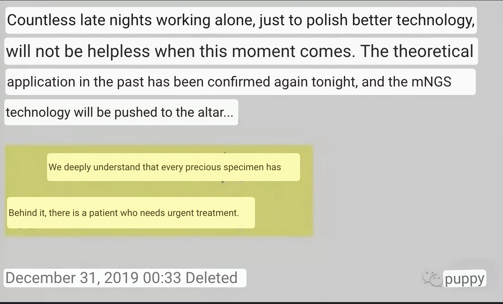  
*Countless late nights working alone, just to polish better technology, will not be helpless when this moment comes. The theoretical application in the past has been confirmed again tonight, and the mNGS technology will be pushed to the altar...  
We deeply understand that every precious specimen has  
Behind it, there is a patient who needs urgent treatment.  
December 31, 2019 00:33 Deleted*

Early on December 31, rumors about SARS started spreading widely on Weibo. I was waiting to see what the official response would be. In the afternoon, the official announcement was made, saying only that it was "pneumonia of unknown origin", without mentioning what the pathogen was, and that there were 27 similar cases, seven of which were serious. After seeing this news, I felt bad, guessing that this virus is not low in infectivity. However, the official notification is "no obvious human-to-human transmission", the early data is not much, the situation is not easy to judge, not to mention the new virus, in order to stabilize the social mood, to avoid excessive public panic, such a notice is actually understandable.

At this time, the expert group has begun to intervene, Wuhan Institute of Virus and other "national team" also began to analyze the identification, they know more information, have more samples and data, but also better equipped to be more professional, so the follow-up I did not do too much in-depth analysis of the work, waiting for the official results.

At first I was quite confident in the country's ability to handle these sudden and major public health events, after all, after the baptism of SARS, influenza A and other events. In addition, the plague incident in Beijing just over two months ago was also reported by us through mNGS detection, and they started the emergency procedures on the same day after reporting, and immediately used other methods to verify again, and saw the news early the next morning, and no new cases of infection were found, so the prevention and control was well done. mNGS took great credit for the plague incident, and I think it can play a big role in the prevention and control of this unknown virus. I think it can play a big role in the prevention and control of this unknown virus.

The media started to dispel the rumors, and the first one was issued by Xinjing News, "SARS is a rumor", while People's Daily and others used euphemisms such as "it cannot be concluded that it is SARS", and then eight people who "created the rumors" were arrested. The latter 8 people were arrested. After seeing these news, somehow I was suddenly a little disappointed in my heart. What is scientifically inconclusive or controversial is directly a rumor? I started to get the feeling that this kind of rumor-mongering and over-optimistic propaganda would push the matter to an irreversible situation. High-profile media disinformation would interfere with the scientific characterization of this virus, and overly optimistic propaganda would leave the public lacking in awe and not taking defensive measures. Subsequent developments have once again validated my fears.

After the incident detonated, some friends also came to ask me if I was informed, especially those in Wuhan. After being told to keep it strictly confidential first (after all, someone was arrested), I still revealed a bit of information to them and told them to be sure to take precautions.

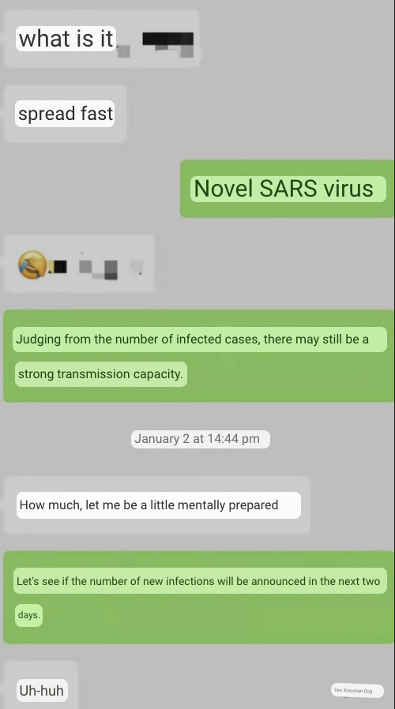  
*what is it  
spread fast  
Novel SARS virus  
Judging from the number of infected cases, there may still be a strong transmission capacity.  
January 2 at 14:44 pm  
How much, let me be a little mentally prepared  
Let's see if the number of new infections will be announced in the next two days.  
Uh-huh*

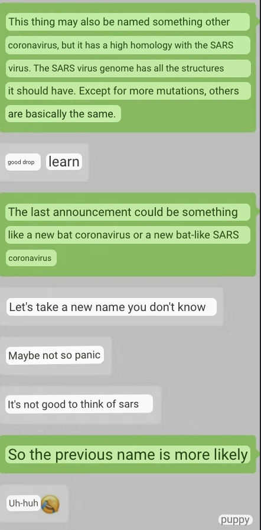  
*This thing may also be named something other coronavirus, but it has a high homology with the SARS virus. The SARS virus genome has all the structures it should have. Except for more mutations, others are basically the same.  
good drop  learn  
The last announcement could be something like a new bat coronavirus or a new bat-like SARS coronavirus  
Let's take a new name you don't know  
Maybe not so panic  
It's not good to think of sars  
So the previous name is more likely  
Uh-huh*

This conversation may also understand why the rumor of SARS, as well as the name of the new coronavirus, after all, the genome similarity is only about 80% (off-topic, enterovirus of the same type of different strains, many of the similarity is only about 80%), SARS has brought us too much trauma, the public is extremely frightened of it.

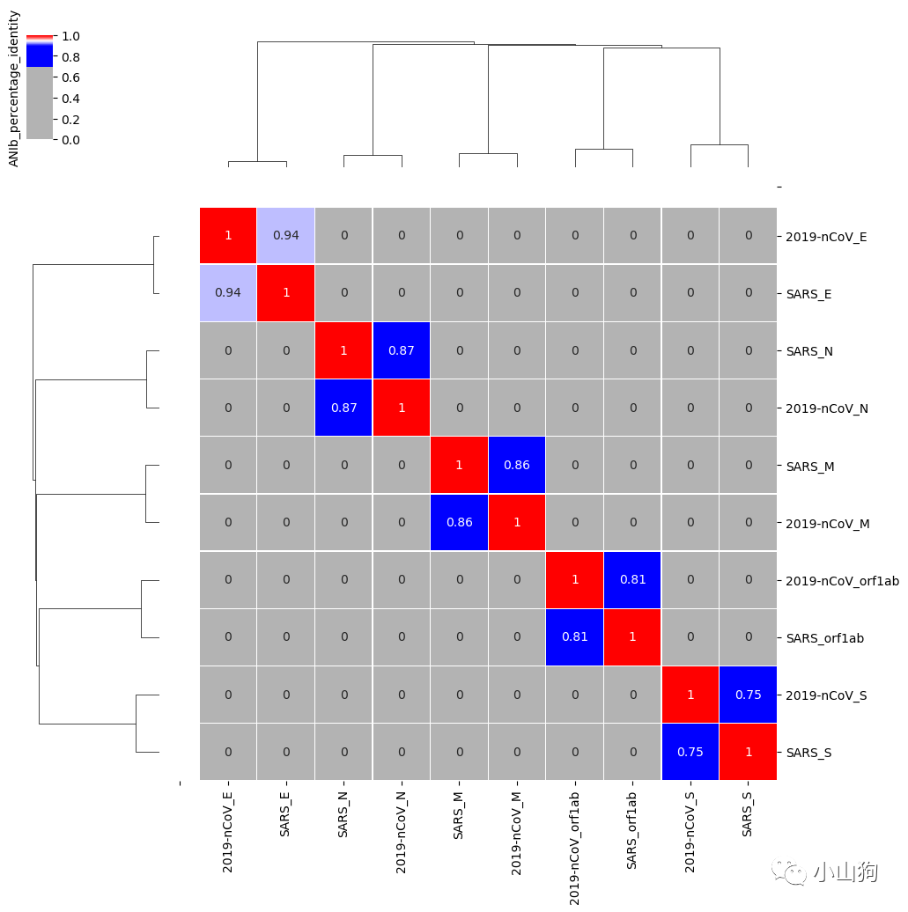

The similarity of the different genes of the novel coronavirus and SARS varies from 75% to 94%, especially the S gene, which is related to the human cell receptor (ACE2), is only 75% similar. So to say that it is not SARS, that's kind of grounded. However, later in Shi Zhengli's article, the new coronavirus also belongs to SARSr-CoV (SARS-associated coronavirus) by their methodological analysis.

The subsequent development of the event is known to all. Here are a few more questions.

Why did we analyze the unknown virus as a coronavirus similar to SARS in two days and report all the analysis results, but it took until January 7 for the official announcement to clarify that the pneumonia was caused by the novel coronavirus?

In fact, the work we did was only to analyze and identify the virus in the samples sent for testing, but whether the pneumonia was caused by this virus, we did not analyze and could not analyze, and the detection of the virus does not mean that the pneumonia was caused by the virus. In such a major health event, the officials naturally have to be rigorous in their argumentation, and there is also an international reference verification process (Koch's Law). Officials have to do not only detect multiple samples with such a virus, but also verify that the pneumonia is caused by this virus, etc.

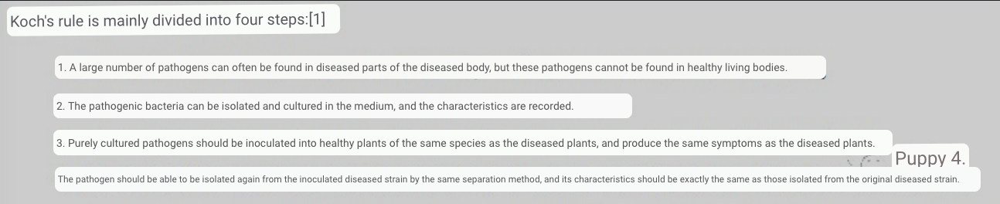  
*Koch's rule is mainly divided into four steps:[1]*
*1. A large number of pathogens can often be found in diseased parts of the diseased body, but these pathogens cannot be found in healthy living bodies.*
*2. The pathogenic bacteria can be isolated and cultured in the medium, and the characteristics are recorded.*
*3. Purely cultured pathogens should be inoculated into healthy plants of the same species as the diseased plants, and produce the same symptoms as the diseased plants.*
*The pathogen should be able to be isolated again from the inoculated diseased strain by the same separation method, and its characteristics should be exactly the same as those isolated from the original diseased strain.*

Isolation, incubation, validation, etc. all of these are time consuming and have to be discussed and agreed upon by experts. As we can see from the many papers on novel coronaviruses published in recent times, many sequencing data were completed in the first two or three days of January.

There is also a very impressive thing about this story: people who know the truth are silent, while those who don't know the truth are "vigorously popularizing" and "deeply analyzing"; companies who have experienced it themselves are afraid to say anything, while other companies are taking advantage of the marketing. From the plague to the new coronavirus are all like this, oh, so interesting.

To talk about the whole event, the biggest feeling is disappointment, pain, and anger. We have found it so timely, why is it still not under control? The epidemic war that got the country into? It's not so much the science, or the technology, but the decision making and the media.

I used to be a very cynical person, it has come to this, there is no way to turn back the clock, passing confidence is the most important thing, right? After the horse, everyone is an elite, who did not expect things to develop into this way, so it is not too lazy to criticize many things. But there are still some things I want to say.

The repudiation of SARS, the optimism promoted by the media, these were not too much of a problem in the earliest days, after all, the knowledge of this virus was very limited. In response to these major public health events, the CDC system may adopt the "strict internal and external" rules, internal caution, strict verification, careful assessment, external announcements may be optimistic to avoid causing excessive panic. In addition, in this incident, how to give the public an account, apparently not the CDC system can make decisions alone.

It goes without saying that Wuhan is a transportation hub, and it was also close to the Chinese New Year, which is the peak season for restaurants, tourism, movies and other services. Pessimistic propaganda will undoubtedly hit these services hard, and will also cause excessive panic among the public, leading to material looting, social chaos and other serious consequences. If the virus really has no ability to spread, or because the measures taken to stifle the spread of the virus, society does not see what harm this virus can bring, decision makers will certainly be called out for overreacting, making a big deal out of it, and then naturally to take the blame. On the contrary, overly optimistic propaganda, the virus is not strong is all happy, happy for the New Year, the virus is strong will lead to a lack of public awareness of prevention, prevention and control work is difficult to carry out, and ultimately lead to the rapid spread of the virus, producing more serious consequences. So, when you as a decision maker, you have to consider all aspects of the factors, social, economic and political aspects need to do a balance, very test the ability and vision of decision makers and experts.

If you go right, you will be uneventful, if you go wrong, you will be a sinner for a thousand years.

There is no parallel universe in this world, we can't know which decision is more right or more wrong. In the country this kind of thing like to optimistic propaganda above the atmosphere, as well as the existence of fluke, decision makers to do what decision, can be imagined.

In the late development of the incident, especially since about January 12, I believe experts have seen things are going in a bad direction (the first 41 patients diagnosed, about 30% do not have a history of exposure to seafood markets, at this time many places began to appear suspected cases, some have preliminary nucleic acid positive). But in the follow-up propaganda is still too optimistic and artistic, while still continuing to disinformation, has not yet issued any signs of warning. The phrase "limited human-to-human transmission is not ruled out, and the risk of ongoing human-to-human transmission is low and preventable and controllable" is rather cautiously worded, not to mention whether it is overly optimistic, but how many ordinary people know what "limited human-to-human transmission" is? What is "sustained human-to-human transmission"? Their understanding may be that there is basically no human-to-human transmission, so they are naturally unsuspecting. I also popularized it in my circle of friends.

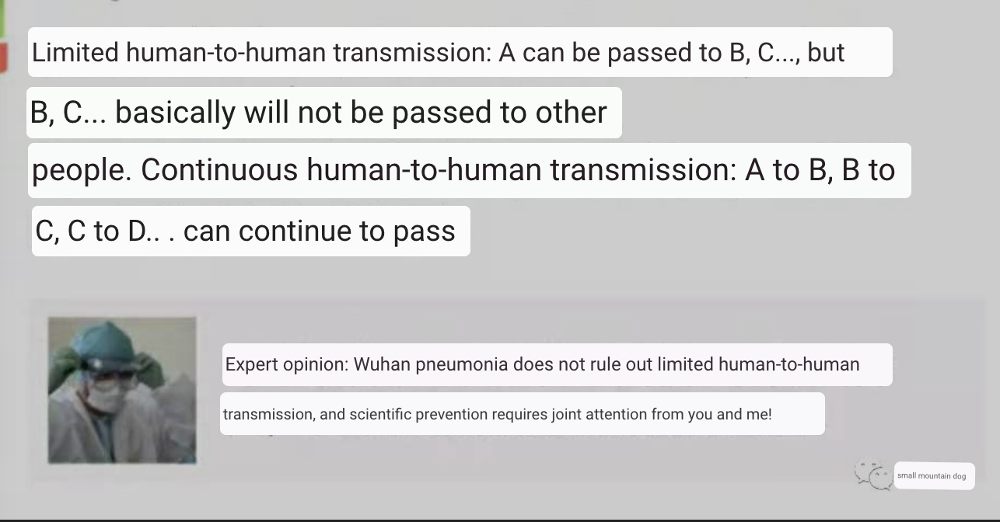

*Limited human-to-human transmission: A can be passed to B, C..., but B, C... basically will not be passed to other people. Continuous human-to-human transmission: A to B, B to C, C to D.. . can continue to pass  
Expert opinion: Wuhan pneumonia does not rule out limited human-to-human transmission, and scientific prevention requires joint attention from you and me!*

From the many papers published now can also be seen, many experts have long had a deeper understanding of the ability of this virus to spread, the further back, the more data available, the clearer the prognosis of the situation. I believe that experts have long given not very optimistic predictions, but if some people, in order to take into account the face of some people or some media (after all, before the publicity is too optimistic, now hit the face too painful), disregard for expert opinion, disregard for the health of the people, had to go to the top of the optimistic notice, insist that no warning is issued, this is inexcusable. Whoever it is, the penalty of the penalty, the removal of the removal.

Not much else to say, talk about some hope.

mNGS is indeed a good technology that plays a big role in the diagnosis of difficult and critical cases, as well as in the early monitoring and outbreak surveillance of such sudden and major public health events. There are many vendors providing mNGS pathogen detection services, and it is recommended that the CDC system can establish direct communication channels with some good technology companies to respond more quickly to emergencies like this. In addition, mNGS companies can also establish an information sharing platform to share information in a timely manner when encountering these events to see if there is an outbreak (I know this is difficult, on the one hand it is supposed to be a commercial secret, on the other hand sensitive pathogens no one dares to report easily, but I still think this is very meaningful and I hope it can become a reality one day).

I also hope that after this novel coronavirus incident, the country's ability to handle major public health events has made great progress. Personally, I think we can learn from the rule of weather forecasting - "always forecast to the more dangerous side" - in order to remind people to take more precautions and lower their psychological expectations. As the saying goes: no expectations, no disappointment.

This is like an end-of-year exam for me. I have used all my knowledge and handed in a passable answer sheet, but did it make the most of it? The first time I personally participated in such a major public health event, made a small contribution, but also exercise and grow a lot.

As far as I know, we were the first to discover the virus, because it was also after we reported the results that the CDC system started to intervene. From the data submitted on the GISAID database website, we were also the first to collect the samples. Perhaps other institutions have also detected this virus, but it is an unknown virus and there is no reference genome in the nucleic acid database, so they do not necessarily have the raw letter capacity to analyze and identify it.

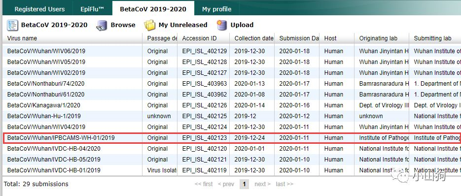

So, I guess that's how we first discovered this new coronavirus, for the record.

Let's hope we beat the epidemic sooner rather than later.

Go China! Go Wuhan!
