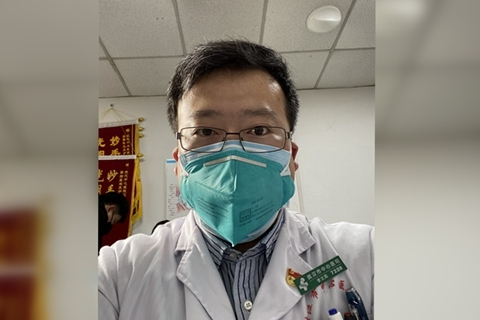
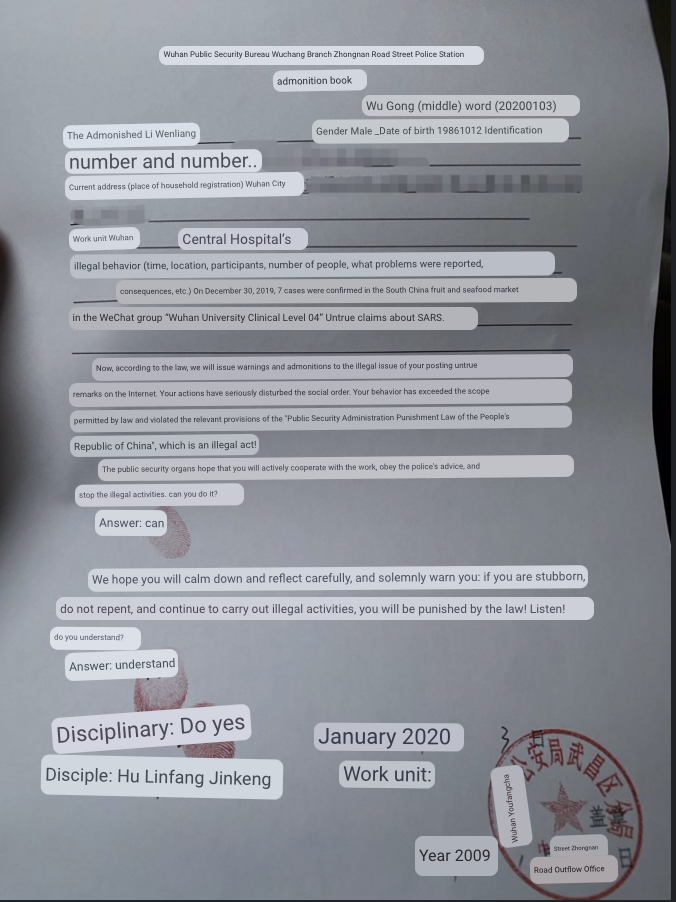

Source <http://china.caixin.com/2020-02-07/101509761.html>, archived <https://archive.ph/z7Hgn>

Transleted with [deepL](https://www.deepl.com/) and Google translate when deepL did not make sense

# Li Wenliang, the "whistle blower" of Newcastle pneumonia: The truth is most important (Updated)

February 07, 2020 02:26 Source: Caixin.com

Wuhan doctor Li Wenliang was the first to disclose information about an unspecified pneumonia and was interviewed by his unit and admonished by the police; on Feb. 1, he was diagnosed with new pneumonia and became critically ill on Feb. 6, and his life is now hanging by a thread

  
*The 34-year-old Li Wenliang, an ophthalmologist at Wuhan Central Hospital, was the first to disclose the situation of unidentified pneumonia and was screenshotted and forwarded and then interviewed by the unit and admonished by the police. He himself was infected during the consultation process, and several colleagues and parents were also infected. Photo courtesy of the interviewee*

[Caixin] (Reporter Qin Jianxing Gao Yu Bao Zhiming Ding Gang) 34-year-old doctor Li Wenliang is still being resuscitated at Wuhan Central Hospital, where he was treated with artificial lungs at around 21:00 on the night of February 6 ecmo. At around 22:00, news broke that he had died. 23:00, a Caixin reporter went to the door of the care unit of the Department of Respiratory and Critical Care Medicine at the Houhu Campus of Wuhan Central Hospital. At around 24:00, there are in and out of the traveling nurses said, not, but inside is still resuscitation. 7 2:00 am, there is a specialist went in for consultation, a colleague of Dr. Li who has been waiting outside the door also followed. Two minutes later, this colleague came out, Caixin reporter asked him how Dr. Li, he deeply bowed his head, did not say a word, silently left.

　　Previously, the ophthalmologist has been infected with the new crown pneumonia, in the downtown hospital respiratory and intensive medical care unit in the isolation ward lying for many days, life and living to rely on colleagues to take care of.

　　On the morning of Feb. 1, Li Wenliang told Caixin that the third nucleic acid test the day before had a positive result: positive. He has been diagnosed with a new type of coronavirus pneumonia. This is an infectious disease that has now been proven to have the characteristics of "human-to-human transmission", and the outbreak is still spreading at an accelerated pace. As of 24:00 on January 30, there were 9,692 confirmed cases and 15,238 suspected cases in China.

　　Li Wenliang, an ophthalmologist at Wuhan Central Hospital, tried to tell his classmates about the dangers he learned at work when the characteristics of "human-to-human transmission" were still unclear, but he was "unlucky" to make an "illegal act The "illegal act".

　　A month ago, at 17:48 on December 30, Li Wenliang posted information in a group of about 150 classmates that "seven cases of SARS were diagnosed in the South China Fruit and Seafood Market and were isolated in the emergency department of our hospital". The same day, the Wuhan Health Care Commission issued an "emergency notice on the work of pneumonia of unknown origin" also circulated on the Internet, which requires strict reporting of information, and stressed that "without authorization any unit, individuals are not allowed to release information on the rescue and treatment".

　　Li Wenliang's reminder in the WeChat group unveiled the mouth. A friend of the group posted a screenshot of his conversation on the Internet, and did not hide the most crucial information: his name and occupation. This allowed those who saw the screenshot to pinpoint him, and he was soon interviewed by the hospital's surveillance department and signed a Letter of Admonishment warning of "illegal issues" at the district police station on Jan. 3.

　　After January 20, as the new coronavirus pneumonia epidemic rapidly developed, the man who had been characterized by the police as publishing inaccurate information was seen as a footnote to the frontline health care workers in the epidemic: he himself was infected during the consultation process and his condition deteriorated to the ICU. in addition, many of his colleagues and parents were also infected with the new coronavirus pneumonia.

When the public traced the outbreak back to its source, they discovered that someone had already warned them, and Li Wenliang became the "whistle blower" who could be found because of his real name on the screenshot. He said he was just trying to alert his classmates and didn't think much of it. He was angry when the screenshot was disseminated, but he understood that the public was worried about the public health situation and let it go. And now whether he is vindicated is not so important, because the truth is more important than this, a healthy society should not have only one voice.

　　With Li Wenliang also raised concerns about the eight rumor-mongers previously notified by Wuhan police, who were once investigated and punished on CCTV news. Li Wenliang said it was not clear whether he was one of the eight. The first time the official microblog of Wuhan Public Security Bureau "Safe Wuhan" informed that eight offenders had been summoned was at 17:38 on January 1, while Li Wenliang said he first went to the police station on the morning of January 3. On January 29, when Wuhan police informed the matter for the second time, there was no mention of the reprimand Li Wenliang received. The police also did not mention the disciplinary action taken against Li Wenliang.

　　In addition to Li Wenliang, the Caixin reporter also contacted a person who was documented to have issued a warning in a WeChat group, which was later forwarded in a screenshot, and who is also a doctor. The woman, who asked not to be named, declined Caixin's request for an interview, and again, it was not enough to determine whether she was one of the eight "rumor-mongers". She responded that she did not want to mention these things because the focus now is on raising supplies for the hospital.

　　On Jan. 30, Li Wenliang gave an interview to Caixin reporters under his real name. He is a native of Liaoning and is 34 years old. He said he didn't like the society of acquaintances and people, so he wanted to go to university in the south. 2004, he took the college entrance examination, because he wanted a "more stable profession", Li Wenliang enrolled in the seven-year clinical medicine program at Wuhan University. After graduation, he worked in Xiamen for three years before returning to Wuhan in 2014, where he has been working in Wuhan Central Hospital since then.

　　The following is a conversation between Li Wenliang and Caixin reporter.

**"There is obviously human transmission."**

**Caixin reporter:** How is your condition now?

**Li Wenliang:** I'm in the respiratory and intensive care medicine unit to receive standardized treatment, is a four-room isolation ward, currently only two people live, can use cell phones to keep in touch with the outside world, usually by doctors and nurses to take care of me, every day the nurse will help wipe the face, wipe the body. I heard from the doctor today (30th) that my nucleic acid test results have turned negative, but this is the result of a throat swab, which I don't think represents the alveoli. It will take some time for my lungs to recover, I just still have some breathing difficulties, I need high flow oxygen all the time, and I can't eat too much yet.

**Caixin reporter:** The public is very concerned about your posting "7 cases of SARS diagnosed" in the group chat, what was the situation at that time?

**Li Wenliang:** I sent it to a group of about 150 students and emphasized not to spread it at that time, mainly to remind the clinical students to pay attention to protection. Although there were not so many cases at that time, I was afraid that there would be an outbreak and the epidemic would spread because the virus was very similar to SARS.

**Caixin reporter: you mean like SARS will be "human-to-human"?**

**Li Wenliang:** There is obviously human-to-human transmission. Around January 8, I treated such patients myself. At that time, a patient in our ophthalmology department was admitted with acute angle-closure glaucoma. She had poor appetite that day, but her temperature was normal. At first, we didn't think about other places. Later, her glaucoma and intraocular pressure were normal. The next day, she still had poor appetite, and she had a fever at noon. The CT scan of the lungs showed that it was "viral pneumonia". All other indicators were consistent with Criteria for pneumonia of unknown etiology.

The family member who took care of her that night also had fever, and her other daughter also had fever, which was obviously human-to-human transmission. We immediately reported the case to the medical office and the hospital's infection office, and requested a consultation with the hospital's expert team, after which the patient was recommended to be isolated in our department. Three days later, we did a review of her CT, and the results were still "viral pneumonia", and the scope of the disease had expanded and worsened, then the patient was transferred to the respiratory isolation ward, and I don't know what happened after that.

**Caixin reporter:** since there was already a "human-to-human" situation, why were there so few confirmed cases?

**Li Wenliang:** At that time, it was difficult to confirm the diagnosis, the kit was not yet available. But there is no kit can be sent to do nucleic acid testing, but more trouble and time consuming, the specific process I do not know. At that time, our hospital's expert group consulted with the patient in front of us and said they could not decide whether to do the test or not. At that time, the clinical diagnosis was basically made by excluding other causes, such as the specific performance of CT, conventional treatment is ineffective, white blood cells are not high, lymphocytes decreased, these are all reference indicators.

**Caixin reporter:** your own infection is also related to this patient?

**Li Wenliang:** At first the patient did not have fever, I was careless and did not do protection. On January 12, I was hospitalized after checking for respiratory viruses and having a CT scan, which was highly suspected of being New Coronavirus pneumonia. My colleagues in the same department also developed the infection a day or two after me, and my parents were hospitalized three or four days after me with symptoms one after another. Then I experienced a worsening of my condition, and now I have to take antibiotics and antiviral, globulin and oxygen every day.

**Caixin reporter:** Do you have to pay for all these treatment measures yourself?

**Li Wenliang:** Immunoglobulin is bought at his own expense, some are sent by pharmacies, some are bought with the help of classmates. The company has spent 50,000 to 60,000 yuan so far, and I don't know if it can be reimbursed.

**Caixin reporter:** you just mentioned in the group had stressed not to screenshot passed out, but still spread out, what do you think?

**Li Wenliang:** That night, many people on WeChat asked me with screenshots. And they screenshots are not complete, originally after the "confirmed 7 cases of SARS", I also stressed that this is a coronavirus, the specific is still typing, but these screenshots on the Internet did not. I feel unlucky to see these, and may be punished. Because this is sensitive information, and at a sensitive time when the "two meetings" are held. I was angry that the screenshots were not coded. Now I'm looking at it lighter, others may be in a hurry, in order to remind family and friends.

**Caixin reporter:** then after this you were punished?

**Li Wenliang:** The screenshot was released at 1:30 a.m. that night (December 31), the Wuhan Health Care Commission met overnight, and I was mainly called over by our hospital leaders to ask about the situation. After dawn, I was interviewed by the hospital's supervision department, still asking me about the situation, asking the source of information, asking what happened and whether they recognized the mistake.

On January 3, they called me to go to the police station to sign a letter of reprimand, but I had never dealt with the police before, and I was very worried that I wouldn't be able to get out of it if I didn't sign it. I did not say anything to my family, I was under a lot of pressure and worried about the hospital punishment, which would affect my future job promotion and so on. Later, a classmate of mine knew, to help introduce the reporter, I directly with the reporter said these circumstances.

**Caixin reporter:** The first police notification was on January 1, saying that eight rumor-mongers had been summoned at that time, and you were called to the police station on January 3? Does this mean that you were the one who was dealt with in addition to these eight people?

**Li Wenliang:** This is not clear, I can not be sure, what you say is also possible, I now just want to get well soon.

**"A healthy society should not have only one voice."**

**Caixin reporter:** The police gave you a letter of reprimand for making false statements on the Internet, and at that time there were people who thought you had created rumors.

**Li Wenliang:** I don't think it's a rumor, because the report clearly states that it's SARS, and I just want to alert my classmates, and I don't want to cause panic (Li Wenliang also uploaded a test report sheet during the group chat, and the clinical pathogen screening results detected "high confidence" positive indicators of SARS coronavirus, Pseudomonas aeruginosa (Monocytes, 46 oral/respiratory colonizing bacteria - editor's note).

**Caixin reporter:** Since you don't think it's a rumor, have you ever thought about going through the judicial route to get an explanation?

**Li Wenliang:** No, I'm afraid the judicial route is very troublesome, I do not want to find trouble with the Public Security Bureau, I'm afraid of trouble. People know the truth is more important, and the truth is not so important to me, justice is in the heart. Another thing is that some people say I was suspended license is not true, to clarify!

**Caixin reporter:** On January 28, the Supreme Court issued a commentary on the appropriateness of the punishment of the eight "rumor mongers" in Wuhan. You may be one of these eight people, what did you think when you saw it?

**Li Wenliang:** After seeing the Supreme Court article, I was much more relaxed and less worried about the hospital's handling. I think a healthy society shouldn't have only one voice and disagree with using public power to interfere excessively. I still agree with the Supreme Court's article that there should be specific screening. (Is that one of the eight) will not be too concerned, because the most widely spread on the Internet, the Supreme Court article quoted in that article is the one I sent to be screenshot.

**Caixin reporter:** January 29, Wuhan police responded to the eight "rumor mongers", which did not mention the admonition you received, what do you think?

**Li Wenliang:** I can only read the police response, I can not express an opinion, there is no meaning. I'm not sure if I'm one of the eight.

**Caixin reporter:** Some people call you the "early-warning" and "whistle-blower" before the large-scale outbreak of the epidemic.

**Li Wenliang:** I didn't think much about it, but I was just alerted to the news.

**Caixin reporter:** what are your plans afterwards?

**Li Wenliang:** After recovery I still want to go to the front line, now the epidemic is still spreading, I do not want to be a deserter.

**Caixin reporter:** how is the situation of the family now?

**Li Wenliang:** My wife is abroad in her mother's house, Wuhan closed city can not return. Parents should be discharged from the hospital in the near future, temporarily can not find anyone to help, they usually have good health, should be able to take care of themselves after discharge. I talked to them sounded like they were in good shape and could move around on their own.

*Caixin intern reporter Wang Yanyu also contributed to this article*

  
*Wuhan Public Security Bureau Wuchang Branch Zhongnan Road Street Police Station  
admonition book   
Wu Gong (middle) word (20200103)  
The Admonished Li Wenliang  
Gender Male _Date of birth 19861012 Identification number and number..  
Current address (place of household registration) Wuhan City  
Work unit Wuhan Central Hospital’s illegal behavior (time, location, participants, number of people, what problems were reported, consequences, etc.) On December 30, 2019, 7 cases were confirmed in the South China fruit and seafood market in the WeChat group “Wuhan University Clinical Level 04” Untrue claims about SARS.  
Now, according to the law, we will issue warnings and admonitions to the illegal issue of your posting untrue remarks on the Internet. Your actions have seriously disturbed the social order. Your behavior has exceeded the scope permitted by law and violated the relevant provisions of the "Public Security Administration Punishment Law of the People's Republic of China", which is an illegal act!  
The public security organs hope that you will actively cooperate with the work, obey the police's advice, and stop the illegal activities. can you do it?   
Answer: can  
We hope you will calm down and reflect carefully, and solemnly warn you: if you are stubborn, do not repent, and continue to carry out illegal activities, you will be punished by the law! Listen!  
do you understand?  
Answer: understand  
Disciplinary: Do yes Disciple: Hu Linfang Jinkeng  
January 2020 Work unit:  
Wuhan Youfangcha Street Zhongnan Road Outflow Office  
Year 2009*   
[original](pics/caixin_LW_2.png)

Li Wenliang's admonition book. The second drop time 2019 should be 2020, Li Wenliang said this is a clerical error.   Courtesy of the interviewee

For more coverage, please see: [Feature] Newcastle Pneumonia Epidemic Record (updated in real time)   
**Editor: Wang Yiyin | Page Editor: Zhang Xiangyu (ZN036)**
