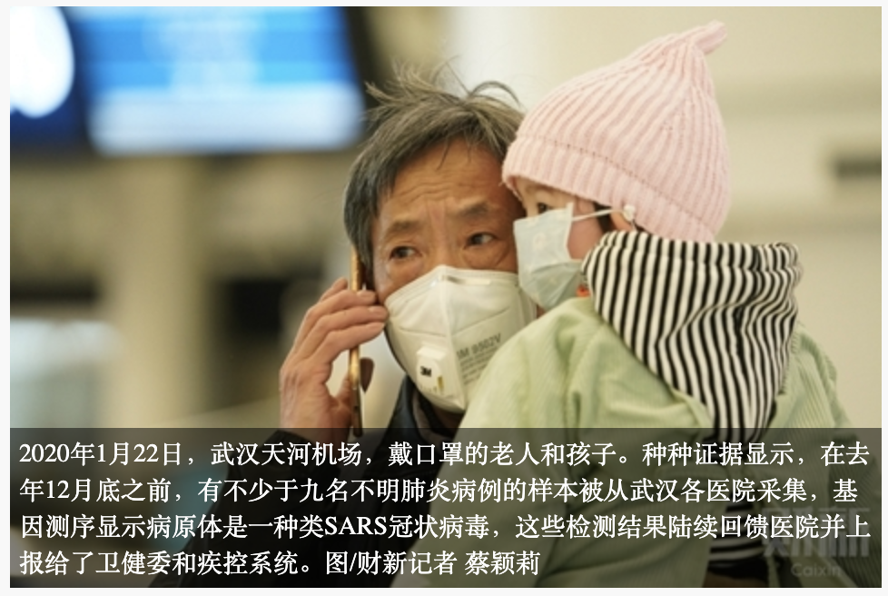

Source <http://china.caixin.com/2020-02-26/101520972.html>,
archived <https://archive.ph/untHJ#selection-499.0-541.137>

Translated with [deepL](https://deepl.com)

# Exclusive|New coronavirus gene sequencing traceability: when the alarm was sounded

*February 26, 2020 22:10 Source: Caixin.com*

*The isolation, detection and gene sequencing of the new coronavirus are the basis for understanding and determining the infectiousness and harmfulness of the new coronavirus epidemic. On January 11, the Wuhan Health Commission, which had stopped updating for several days, changed the name of "viral pneumonia of unknown origin" to "pneumonia of novel coronavirus infection" for the first time, saying that as of January 10, 2020 24:00, the preliminary diagnosis of 41 cases of new coronary pneumonia*

  
*Elderly people and children wearing masks at Wuhan Tianhe Airport, January 22, 2020. All evidence shows that before the end of December last year, samples of no less than nine unidentified pneumonia cases were collected from various hospitals in Wuhan, and genetic sequencing showed that the pathogen was a type of SARS coronavirus, and these test results were successively returned to the hospitals and reported to the Health and Welfare Commission and the CDC system. Photo/Caixin reporter Cai Yingli*

[Caixin] (Reporter Gao Yu Peng Yanfeng Yang Rui Feng Yuding Ma Danmeng) Tracing the roots of the new coronavirus that has killed more than 2,660 people and confirmed more than 77,000 infections as of Feb. 24, when was this new coronavirus, similar to SARS, discovered? The Caixin reporter through multiple interviews, and comb through the relevant papers, database information corroboration, so that the information puzzle gradually complete emerge.

　　All kinds of evidence show that before the end of December last year, samples of no less than nine unidentified pneumonia cases were collected from various hospitals in Wuhan, and genetic sequencing showed that the pathogen was a type of SARS coronavirus, and these test results were successively returned to the hospitals and reported to the Health and Welfare Commission and the CDC system. Until January 9, CCTV reported that the "Wuhan Viral Pneumonia Pathogenic Test Results Preliminary Assessment Panel" officially declared the pathogen as a "novel coronavirus".

**The first case was released on December 27**

On December 15, 2019, a 65-year-old male delivery man from the South China Seafood Market began to develop a fever. On December 18, he came to the emergency department of Wuhan Central Hospital Main Hospital (Nanjing Road Campus) to see a doctor, who suspected that it might be community-acquired pneumonia and admitted him to the emergency department ward of the hospital. Community-acquired pneumonia is a general term for pneumonia caused by a variety of microorganisms, including bacteria, viruses, chlamydia and mycoplasma, with the main clinical symptoms being cough, with or without sputum and chest pain.

　　On December 22, this patient's condition worsened and he was admitted to the ICU, where doctors used various antibiotics to treat him ineffectively. Professor Zhao Su, chief physician of the Department of Respiratory Medicine at Wuhan Central Hospital, told Caixin that on December 24, a deputy chief physician of the Department of Respiratory Medicine performed a tracheoscopic sampling of this patient, and then sent the patient's alveolar lavage fluid sample to a third-party testing organization, Guangzhou Micro Far Gene Technology Co. for NGS testing, hoping to use its second-generation high-throughput gene sequencing technology (mNGS) based on macrogenomics , to identify the pathogen. Alveolar lavage is a therapeutic method to remove inflammatory secretions, etc. from the alveoli and improve respiratory function. For lower respiratory tract and lung diseases, the pathogen content in alveolar lavage fluid is higher than that in pharyngeal swabs.

　　Micro Far Gene, whose full name is Guangzhou Micro Far Gene Technology Co. was established in June 2018. Its job advertisement says it focuses on precision medicine in oncology and infection pathogenesis and has a sequencing platform (NGS) based on second-generation high-throughput sequencing technology.

　　"Since UW Genetics started using sequencing technology, several domestic genetic sequencing companies have emerged, large and small, and over the years, second-generation high-throughput genetic sequencing technology has been constantly introduced at our various medical seminars, and these companies have sent pharmaceutical representatives to major hospitals to deliver lectures." Zhao Su told the Caixin reporter. The company was founded in 1999 and has completed a number of internationally advanced genomic research work, including the Chinese part of the International Human Genome Project, the Rice and Giant Panda Genome Project, etc. In July 2017, it landed on the GEM with the title of "Gene Sequencing In July 2017, the company landed on the GEM as the "first stock" and is the world's largest genomics research and development organization.

　　Another doctor at the Wuhan Union Hospital also introduced, "test once, 6 million base sequences, 3,000 yuan, the 3,000 yuan can find out what the pathogen is a virus or bacteria, it may save lives."

　　Generally, the gene sequencing company should give feedback on the test results three days later, on Dec. 27, but Micro Farms Genetics did not give a written report. "They just notified us by phone that it was a new coronavirus." Zhao Su said. By this time the patient had been transferred to Wuhan Tongji Hospital on Dec. 25.

　　On Feb. 21, 2020, the genetic test information of this case was disclosed in an article by the WeChat public website "Weifangene. According to the article, the Chinese Medical Journal (English version) published [a paper](https://journals.lww.com/cmj/fulltext/2020/05050/identification_of_a_novel_coronavirus_causing.3.aspx) on January 27 about the discovery of the new coronavirus and the involvement of Weifangene in the early detection of the new coronavirus.

　　The aforementioned paper published in the Chinese Medical Journal refers to the article "Identification of a novel coronavirus that causes severe pneumonia in humans: a descriptive study" published on January 29. The authors of the paper are from the Institute of Pathogen Biology, Chinese Academy of Medical Sciences/Beijing Union Medical College (hereafter referred to as the Institute of Pathogen Biology, Chinese Academy of Medical Sciences), China-Japan Friendship Hospital, Hubei Provincial CDC, Wuhan Jinyintan Hospital, Wuhan Central Hospital, and Guangzhou Microgene Technology Co. Xu Teng, chief technology officer of Microgene, is the co-first author of the paper, and Li Yongjun, CEO, and Wang Xiaorui, chief operating officer, are the byline authors. Li Yongjun was a bioinformatics analyst at the Institute of Pathogenesis, Chinese Academy of Medical Sciences.

According to the paper, the researchers collected clinical data and bronchoalveolar lavage samples from five patients with severe pneumonia at the Jinyintan Hospital in Wuhan, Hubei, and performed pathogenic macrogenomics (mNGS) analysis. As a result, a coronavirus with 79% nucleotide sequence similarity to SARS virus, which has never been reported before, was found in all these samples. The paper shows that the first clinical sample from these five patients to be genetically sequenced was a sample from a 65-year-old patient collected on December 24. He developed a high fever and cough with little sputum on December 15. he was admitted to the hospital on the 18th and to the ICU on December 22. 16 days later he still had a persistent high fever that developed into severe shortness of breath.
　　The same high degree of coincidence with the above information is the WeChat public number "Xiaoshan Dog" on January 28th published an article entitled "Record the experience of discovering the new coronavirus for the first time". The author claimed to be working in a private company in Huangpu, Guangzhou, and recorded in the message section: "I just went to work on December 26, 2019, and as usual, I browsed through the mNGS pathogenic microorganism automatic interpretation results for the day. Unexpectedly, found a sample reported a sensitive pathogen - SARS coronavirus, with dozens of sequences, and this sample has only such a meaningful pathogen. With a tight heart, I hurriedly checked the detailed analysis data in the background and found that the similarity was not very high, only about 94.5%. In order to confirm the reliability of the results, a detailed analysis was started. The results of the exploratory version of the analysis suggested that this pathogen was most similar to Bat SARS like coronavirus (bat-like SARS coronavirus), with an overall similarity of about 87%, while the similarity to SARS was about 81%."
　　The patient's sample was also collected on December 24, according to the authors. The article mentions that "the front-end feedback that this patient was seriously ill and anxious for the test results, but such a significant pathogen really cannot be reported easily, and had an urgent meeting with several leaders at noon and decided to continue the in-depth analysis and delay the release of the report, while sharing the data to the Pathogen Institute of the Chinese Academy of Medical Sciences for a piece of analysis." The Institute of Pathogenesis of the Chinese Academy of Medical Sciences, one of the authors of the above-mentioned paper in the Chinese Medical Journal (English version), and the CEO of MicroFarNet, Li Yongjun, worked for the Institute of Pathogenesis of the Chinese Academy of Medical Sciences, whose immediate superior, the president of the Chinese Academy of Medical Sciences, is academician Wang Chen, vice president of the Chinese Academy of Engineering.

　　On Dec. 27, the lab assembled a near-complete sequence of the viral genome, and the data was also shared with the Institute of Pathogenesis of the Chinese Academy of Medical Sciences. "It was basically confirmed that this patient's sample did have a novel virus similar to Bat SARS like coronavirus inside." The article writes, "The information received at the time was that this patient had returned to his hometown and exposure to bats could not be ruled out. Aware of the potential seriousness of the problem, the laboratory was fully cleaned and disinfected, samples were harmlessly destroyed, and the personnel involved in the experimental operation were monitored for this. Have communicated with the doctor before noon, the patient also isolated."

　　"It should be that we first discovered this new coronavirus." The article "Little Mountain Dog" also gives a screenshot of the GISAID database, "From the data submitted on the GISAID database website, the earliest sample collection time is also us."

　　GISAID is a global platform for sharing data on influenza viruses, and researchers can upload their extracted viral genetic sequences after registering. Each strain is given a unique number, and information such as the time of collection, date of submission, and laboratory of submission is also recorded. The Caixin reporter checked and found that, according to the sample collection time, the earliest gene sequence of a new coronavirus on GISAIDS was collected on December 24, 2019 and uploaded by the Institute of Pathogenesis of the Chinese Academy of Medical Sciences on January 11. This is the sample sequence marked in the screenshot of the article "Little Mountain Dog" that their company participated in testing.

　　The article also mentioned that the company's leaders communicated with the hospital and the CDC (department) by phone on December 27 and 28, and even personally went to Wuhan on the 29th and 30th to report and exchange all the analysis results with the hospital and CDC leaders in person, "including all our analysis results and the analysis results of the Institute of Pathogenesis of the Academy of Medical Sciences. Everything was under intense, confidential and strict investigation (at this time, people at the hospital and CDC already knew that there were several similar patients, and we had already started emergency treatment after communicating the test results)".

　　The owner of the earliest known sample to complete the genetic sequencing mentioned above, later died in Jinyintan Hospital. The results of this case, which had been detected on December 27 as a new outbreak of the virus, also did not play any role at that time.

**"SARS coronavirus" explodes on social media**

　　In fact, in addition to the earliest known case, two other samples from patients with "pneumonia of unknown origin" were sent to different institutions for genetic sequencing at the Wuhan Central Hospital in late December 2019. The test results of these two cases had a significant impact on the disclosure of the outbreak by different pathways.

　　On December 27, a 41-year-old man surnamed Chen visited Wuhan Central Hospital Nanjing Road Campus. "He is an accountant, his family lives in Wuchang, has not been to the South China Seafood Market in Hankow at all, probably on December 16 without obvious cause began to fever, the highest temperature of 39.5 ° C, accompanied by palpitations, chest tightness, breathing difficulties after activity, physical strength decreased significantly, first on December 22 in the Jiangxia District First People's Hospital to see a doctor, no improvement. " Zhao Su revealed to the Caixin reporter, "he is an acquaintance of a doctor in our hospital, the 27th was transferred to our hospital, also admitted to the emergency department." In the evening of December 27, the patient did a bronchoscopy sample in the hospital's respiratory ICU, and this time the sample was sent to another company engaged in NGS testing, Beijing Boao Medical Laboratory Co.   

　　On December 30, the Beijing Boao Medical Laboratory sent the patient's test report back to the doctor, and the test result was directly "SARS coronavirus" (SARS coronavirus).  

　　The test report of the Beijing Boao Medical Laboratory obtained by the Caixin reporter showed that high confidence positive indicators for SARS coronavirus and Pseudomonas aeruginosa were detected in the patient's sample. The SARS coronavirus is explained therein as a single-stranded positive-stranded RNA virus that is transmitted by proximal droplet transmission or contact with the patient's respiratory secretions and can cause a specific type of pneumonia, also known as atypical pneumonia, that is significantly infectious and can involve multiple organ systems.

　　"Their gene pool is not complete enough, or maybe they didn't do a review, so they made a small mistake, which is actually not the same thing as SARS, which is a new coronavirus." A gene sequencing expert revealed to Caixin reporter.

　　However, it was the test report that made a small mistake that directly caught the attention of Wuhan doctors and blew the alarm whistle to the public through social media, saving the lives of a considerable number of people to some extent.

　　On December 30, the test report from the Beijing Boao Medical Laboratory appeared in the WeChat of doctors at Wuhan Central Hospital. At 17:48 that evening, Li Wenliang, an ophthalmologist at Wuhan Central Hospital, released information in a group of classmates: "Seven cases of SARS were confirmed in the South China Fruit and Seafood Market and were isolated in the emergency department of our hospital"; at 19:39, Liu Wen, a neurologist at Wuhan Red Cross Hospital, was in a working WeChat group "Concordia Red Cross Society God within" released information that: "just the second hospital (i.e. Wuhan Central Hospital) Houhu Hospital confirmed a case of coronary infectious virus pneumonia, perhaps around South China will be isolated", "SARS has basically determined that Nurse sisters do not go out to shake"; 20:48, Wuhan Union Hospital Oncology Center doctor Xie Linka in the Oncology Center WeChat group released a message that "do not go to the South China seafood market in the near future, where there are now a number of people suffering from unexplained pneumonia (similar to SARS), today our hospital has admitted a number of cases of pneumonia in the South China seafood market Patients, everyone pay attention to wear masks and ventilation" - the three doctors have since been admonished by the police.

On the same day, the author of the article "Xiaoshan Dog", who was in Huangpu, Guangzhou, was also informed of the above-mentioned news, and he recounted: "By December 30th, I heard the news that there were quite a few more patients with similar symptoms, and my nerves were tense again. In particular, about the afternoon of the 30th, a friend of the business may have detected the same virus in another patient's sample, but they directly sent a report of the detection of SARS coronavirus, which instantly set off the news ...... friends shared the sequence for our analysis, and when I analyzed it, it was indeed the same virus! The first subconscious thought was 'this virus is contagious'!"

　　Li Wenliang and others uncovered the lid, allowing the story of the line of sequencing by the genetic company to intersect with the story of another clinician warning. While doctors at Wuhan Central Hospital were looking to gene sequencing companies for answers to the ever-present viral pneumonia patients whose conventional treatments were ineffective, Zhang Jixian, director of the Department of Respiratory and Critical Care Medicine at Xinhua Hospital in Hubei Province, adjacent to the South China Seafood Market, saw four consecutive cases of unexplained pneumonia on December 26, and on December 27, Zhang Jixian found four " On December 27, Zhang Jixian reported the discovery of four cases of "unexplained viral pneumonia" to the hospital, and the hospital reported them to the Jianghan District CDC.

　　On December 28-29, Xinhua Hospital admitted three more patients from the South China Seafood Market, who had similar symptoms of viral pneumonia. According to later reports such as the Wuhan Evening News, at 1 p.m. on December 29, Xinhua Hospital Vice President Xia Wenguang called ten experts to discuss the seven cases, and the experts agreed that the situation was unusual and Xia Wenguang reported the case directly to the Disease Control Division of the provincial and municipal health committees. Also reported on the same day was the Public Health Department of Wuhan Central Hospital. In the afternoon of the same day, Hubei Province, Wuhan City Health Commission CDC notified the provincial, municipal and district level CDC, Xinhua Hospital, Downtown Hospital Houhu Hospital admitted a number of patients with a history of exposure to seafood markets with unknown pneumonia, requiring the start of emergency disposal workflow. Hubei Province CDC, Wuhan CDC in conjunction with Jianghan District, Qiaokou District, East and West Lake District CDC began epidemiological investigation, Wuhan Jinyintan Hospital Vice President of Operations Huang Chaolin and other came to Xinhua Hospital, picking up six patients, Wuhan Tongji Hospital also transferred the aforementioned first patient in the downtown hospital to do genetic testing to Jinyintan Hospital.

　　On December 30, the tertiary CDC formed the "investigation and disposal report on the situation of multiple cases of pneumonia reported by the hospital in the South China Seafood Market". On the same day, the Wuhan Municipal Health Commission issued an internal notice, mentioning that a number of medical institutions in Wuhan did appear one after another multiple cases of unexplained pneumonia, and associated with the Wuhan South China Seafood Wholesale Market, requiring medical institutions to report patients with similar characteristics of unexplained pneumonia seen in the last week.

　　This "urgent notice on the treatment of pneumonia of unknown origin" of the Wuhan Health Care Commission, which was triggered by Zhang Jixian's insistence on reporting, was soon exposed online, together with the weibo warnings of doctors such as Li Wenliang who saw the gene sequencing report, allowing information about the outbreak that started in Wuhan to reach the outside world for the first time.

**Early warning from Shanghai**

　　Another case sample from Wuhan Central Hospital came from the Houhu hospital area, which is also adjacent to the South China Seafood Market, and was admitted a day earlier. The patient, also surnamed Chen, is a 41-year-old self-employed seafood market operator from Quanzhou, Fujian Province, who developed a high fever of 40°C, generalized aches and pains, coughing and pus, chest tightness and shortness of breath after suffering a cold on December 20, and was admitted to Wuhan Central Hospital Houhu Hospital on December 26 with "fever investigation and lung infection", and on December 30 The hospital took a bronchoscopic sample and left an extra copy of the respiratory lavage fluid sample in the refrigerator at -80°C for storage.

　　"The reason for keeping an extra sample is that we have been cooperating with the Shanghai Public Health Clinical Center affiliated with Fudan University (hereinafter referred to as Shanghai Public Health Center) and Wuhan CDC on a major national science and technology project, 'China's major natural epidemic virus resources'. Wuhan CDC is responsible for the collection of clinical samples and environmental specimens in the Central China region, which are regularly sent to the Shanghai Public Health Center for pathogen testing, and they have a biosafety level 3 (BSL-3) laboratory with high-throughput sequencing and bioinformatics analysis platform, while hospitals like ours are sentinel hospitals of the Wuhan CDC." Professor Zhao Su, Department of Respiratory Medicine, Wuhan Central Hospital, introduced.

　　The samples were taken by a chief physician at the Wuhan CDC in the afternoon of Dec. 30. on Jan. 2, another researcher at the Wuhan CDC wrapped the samples heavily in dry ice, iron boxes and foam boxes and sent them, along with other animal specimens, by rail express to Shanghai. on Jan. 3, Professor Zhang Yongzhen's team at the Shanghai Public Health Clinical Center received the samples. This center belongs to Fudan University, Zhang Yongzhen himself is a researcher at the Institute of Infectious Disease Prevention and Control of the Chinese Center for Disease Control and Prevention, part-time professor at the Institute of Biomedical Research of Fudan University and the Shanghai Public Health Center, and has been engaged in scientific research work on human-animal infectious diseases and the investigation of major natural epidemic viral resources in China in recent years under the funding of the National Natural Foundation of China, national major special projects and national key research and development programs, including Wuhan City Central Hospital, including a number of hospitals and the Wuhan CDC and the University of Sydney, Australia, are members of the subject team.

　　In the early morning of January 5, Zhang Yongzhen's research team detected a novel SARS-like coronavirus from the sample and obtained the whole genome sequence of the virus through high-throughput sequencing; the evolutionary tree drawn from the sequencing data also confirmed that the novel coronavirus in Wuhan was never seen before in history. The Shanghai Public Health Center immediately reported to the Shanghai Municipal Health and Wellness Commission and the National Health and Wellness Commission and other authorities that day, alerting them that the new virus was homologous with SARS and should be transmitted via the respiratory tract, and suggesting appropriate disease control and epidemic prevention measures in public places. on January 6, the CDC initiated a Level 2 emergency response internally.

　　"We have been working with the Wuhan CDC and Wuhan Central Hospital to collect new viruses of natural epidemic origin, which is part of our major national project, including the use of the P3 laboratory, which is also accredited by the China National Accreditation Service for Conformity Assessment." A researcher at the Shanghai Public Health Center told Caixin, "We are a routine scientific research, and the incidental discovery, which is of great importance, was reported immediately."

**At least nine samples were collected and sent for testing at the end of last year**

　　The company's reporters confirmed that several other gene sequencing companies obtained samples of unidentified pneumonia cases from Wuhan Hospital almost around the same time as Guangzhou Weifuan Gene Technology Co. and Beijing Boao Medical Laboratory. This includes the industry's "leader", Huada Gene, which received a gene sequencing commission from a local hospital in Wuhan on Dec. 26, 2019. on Dec. 29, the gene sequencing results completed by Huada Gene on the case sample showed that the virus had 80% gene sequence similarity to SARS, but was not SARS, but a previously unavailable coronavirus. UW Genetics also tested the case with their SARS test kit and the results were negative, denying that it was SARS.

　　A UW Genetics source told Caixin that when they sequenced samples from cases of unexplained viral pneumonia in late December, they were unaware that the virus had clinically infected many people and had even caused aggregated infections in the same family. "We are a technology company that does genetic sequencing, and we receive many sequencing commissions every day, and we are exposed to a large number of viruses, and we find many new viruses. The company is a genetic sequencing technology company that receives many sequencing commissions every day and is exposed to a large number of viruses, and also discovers many new viruses. there are many kinds of coronaviruses, including SARS, and there are only six coronaviruses associated with people, and only SARS and MERS are more infectious to people. at that time we did not know whether this virus was 'good' or 'bad'. "

　　The UW gene has a perennial cooperation with the local hospital in Wuhan, which, according to a Caixin investigation, sent at least more than 30 samples of suspected pneumonia cases to the UW gene in December 2019 for commissioning sequencing. UW found a total of three cases of pneumonia belonging to the new coronavirus infection among them, except for this one case on December 26, and the other two cases received samples on December 29 and 30, respectively. On January 1, the test reports of the three samples were submitted to the Wuhan Municipal Commission of Health, and on January 3, UWM performed a high-depth full gene sequence sequencing of the viruses in all three samples.

　　The Caixin reporter found out that as of January 19, 2020, there were 13 samples of the new coronavirus genome sequences uploaded on the GISAID platform. Except for three from Japan and Thailand, the remaining 10 were all uploaded by Chinese research units. In terms of sample collection time, the earliest one is the aforementioned one collected on December 24, 2019 and uploaded by the Institute of Pathogenesis, Chinese Academy of Medical Sciences. Eight other samples were collected on December 30, from Wuhan Jinyintan Hospital and Hubei Provincial CDC (1 entry), Jinyintan Hospital and Wuhan Institute of Virus Research, Chinese Academy of Sciences (5 entries), and the Institute of Prevention and Control of Viral Diseases, China CDC (2 entries). In addition, the Institute for Prevention and Control of Viral Diseases of the Chinese CDC uploaded a gene sequence for samples completed for collection on January 1, 2020.

　　Mirroring this, Hubei Daily reported that on the day of December 30, Jinyintan Hospital President Zhang Dingyu led the collection of bronchoalveolar lavage fluid from the first seven patients admitted to the hospital and sent it to the Wuhan Institute of Virus of the Chinese Academy of Sciences for testing.

　　With an industry average testing cycle of three days, the gene sequencing results of the above eight samples collected on December 30 should have been available by around January 2. Wuhan Institute of Virus, Chinese Academy of Sciences, in an open letter "Wuhan Institute of Virus is fully engaged in scientific research on new coronavirus pneumonia" had said that the Institute of Virus received an unidentified pneumonia sample from Jinyintan Hospital on the night of December 30, and after 72 hours of research, the whole genome sequence of the new coronavirus was determined on January 2, 2020, and uploaded to GISAID on January 11.

　　The aforementioned paper published in the Chinese Medical Journal (English version) also showed that alveolar lavage fluid samples from five patients were collected and sent for testing and analysis during the nine-day period from December 24, 2019 to January 1, 2020, and that two of these five patients had no history of exposure to the South China Seafood Market.

　　Of the five patients, in addition to the 65-year-old patient sample mentioned above, three other patients had samples collected on December 30, 2019. Of these, patient #2 was a 49-year-old female working at the South China Seafood Market who began having a high fever and dry cough on December 22, developed respiratory distress and was hospitalized five days later, and was admitted to the ICU on December 29; patient #3 was also a female, 52 years old, who developed a fever on December 22 and was hospitalized on December 29, but she had no history of seafood market exposure; patient #4 was a 41-year-old male who on December 16 He began to have a high fever and dry cough and was hospitalized on the 22nd - this male, who also had no history of seafood market exposure, was apparently the Wuchang accountant seen above at Wuhan Central Hospital; patient #5, whose alveolar lavage fluid sample was collected on January 1, 2020, was a 61-year-old male who worked at the South China Seafood Market and himself had chronic liver disease and abdominal mucinous tumor, was admitted to a local hospital after seven days of fever, cough, and respiratory distress, and began resuscitation using ECMO on January 2 before succumbing.

　　According to the paper, a novel coronavirus was thus identified in the laboratory with 79% nucleotide sequence similarity to the SARS virus, which is phylogenetically closest to the SARS-like coronavirus carried by bats, but forms a separate evolutionary branch of the coronavirus beta genus strain sequence. After conducting virus isolation for morphological confirmation and serological testing, the new pathogen was finally confirmed to be a novel coronavirus. The structural domain of this virus that binds to the receptor has an amino acid sequence similar to that of the SARS coronavirus, suggesting that both viruses may bind to the same receptor on human cells.

The days between the end of December 2019 and the beginning of January 2019 should have been critical in determining the fate of countless people. But at that time, the public was still oblivious to the consequences that this virus would later trigger.

　　A gene sequencing company revealed that on January 1, 2020, he received a phone call from an official of the Hubei Provincial Health Commission, informing him that samples of cases with new crown pneumonia in Wuhan were sent for testing and could not be retested; samples of existing cases had to be destroyed, no information about the samples could be disclosed to the public, no relevant papers or relevant data could be released to the public, and "if you detect it at a later date, you must report to us."

　　On January 3, the General Office of the National Health Commission issued a notice titled "Notice on Strengthening the Management of Biological Sample Resources and Related Scientific Research Activities in the Prevention and Control of Major Emerging Infectious Diseases," this National Health Office Science and Education Letter (2020) No. 3 document said that for the recent Wuhan pneumonia case samples, based on the currently available information on pathogenic characteristics, transmissibility, pathogenicity, clinical information, etc., until further clarification of pathogenic Until further clarification of the information, the temporary management of highly pathogenic microorganisms (category II), the transport of samples should be in accordance with the former Ministry of Health "infectious human highly pathogenic microorganisms strains (viruses) or samples transport management regulations"; pathogen-related experimental activities should be carried out in biosafety laboratories with the appropriate level of protection.

　　No. 3 further stipulates that all relevant institutions should provide biological samples to designated pathogen detection institutions for pathogenic testing and proper handover procedures in accordance with the requirements of the administrative departments of health at the provincial level or above; without approval, biological samples and their related information shall not be provided to other institutions and individuals; institutions and individuals who have obtained biological samples of relevant cases from relevant medical and health institutions shall immediately destroy the samples in situ or During the period of epidemic prevention and control, the information generated by various institutions undertaking pathogenic testing tasks is a special public resource, and no institution or individual may release information about pathogenic testing or experimental results without permission.

　　As for which institutions belong to the "designated pathogen detection institutions", the document does not mention. Virologists revealed that even the Wuhan Institute of Chinese Academy of Sciences were once asked to stop pathogen testing, the destruction of existing samples, "because according to the current "Prevention and Control of Infectious Diseases Law", to carry out laboratory testing of infectious diseases, diagnosis, pathogenic identification is the legal responsibility of disease prevention and control agencies at all levels, only the national and provincial institutions of the disease control system is authorized to carry out the pathogenic identification of infectious diseases. The Wuhan Institute of Virus of the Chinese Academy of Sciences is clearly not among them, not to mention those unauthorized commercial research institutions".

　　Perhaps because of this, on December 30, the virus samples from the Chinese Academy of Sciences, the virus isolation on January 1, 2020, January 2, completed the genetic sequencing of the virus, January 5, isolated the virus strain, January 9, completed the national virus repository into the library and standardized storage. These apparently day and night to complete the research work, delayed the public announcement, only in February when facing the outside world rumors of attack, only to give only a word of disclosure.

　　On January 9, CCTV reported that the CDC-based "Wuhan Viral Pneumonia Pathogen Test Results Preliminary Assessment Expert Group" determined that the pathogen was a novel coronavirus, "As of 21:00 on January 7, 2020, a novel coronavirus was detected in the laboratory, and the full genome sequence of the virus was obtained. As of 21:00 on January 7, 2020, the laboratory detected a novel coronavirus, obtained the full genomic sequence of the virus, and detected a total of 15 positive results for the novel coronavirus by nucleic acid detection methods, and isolated the virus from one positive patient sample, which showed a typical coronavirus morphology under electron microscopy."

　　On January 11, Zhang Yongzhen's research team shared the virus genome sequence information on Virologic.org and GenBank, the first team in the world to publish the virus sequence.

　　Later that day, the National Health Commission announced that China would share the genetic sequence of the new coronavirus with the WHO. The next day, five other viral genome sequences from different patients were released on GISAID, the Global Shared Influenza Virus Database, by a team led by the National Health and Wellness Commission. Which organization did this sharing of new coronavirus gene sequence information to WHO come from? Gao Fu, director of the Chinese CDC, responded to the Caixin reporter, saying that the gene sequence came from three institutions, the Chinese CDC, the Chinese Academy of Medical Sciences and the Chinese Academy of Sciences, and this is a joint research. The WHO said it has obtained more detailed information about Wuhan unexplained viral pneumonia from China's National Health Commission, including information on the gene sequence of the novel coronavirus detected from the case, which is important for other countries to develop specific diagnostic tools.

　　At this point it is not really necessary to go into detail about who was the first to pick the pearl in the scientific crown, as 15 days have passed since the first case of genetic sequencing identified the new coronavirus.

　　On January 11, the Wuhan Health Commission, which had stopped updating for several days, changed the name of "viral pneumonia of unknown origin" to "pneumonia of new coronavirus infection" for the first time, saying that as of 24:00 on January 10, 2020, the preliminary diagnosis of new coronavirus pneumonia cases was 41 cases. On the same day, the "two sessions" of Hubei were held. By the end of Hubei's "two sessions" on January 17, the number had not increased.

　　Caixin reporter Zhao Jinzhao and intern reporter Huang Yuxin also contributed to this article.  
Editor: Gao Yu | Page Editor: Xu Jinling (ZN037)
